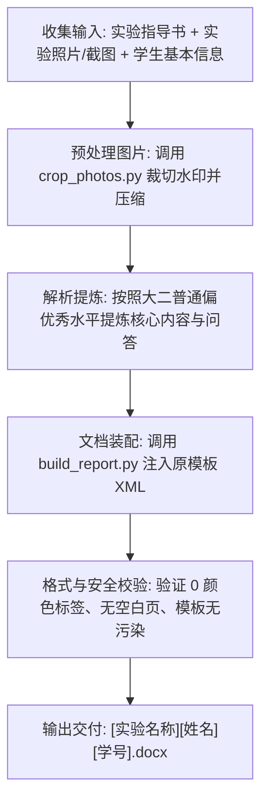

# 河北大学选修课操作系统实验 Skill

本 Skill 沉淀了河北大学（HBU）电子信息工程学院《操作系统实验》（课程号：`1323D00040/01`，通常开设在大二上学期秋学期，选修课性质）的实验报告编制全流程、排版标准、避坑经验与自动化脚本套件。

---

## 🎯 核心定位与写作口吻

1. **课程性质**：大二上学期计算机/工科选修课（如 25 自动化专业）。
2. **语言风格**：
   - **真实、通顺、普通偏优秀**（良好到优秀水平的大二学生实际作业口吻）。
   - **切忌过度学术化或生硬八股**：不要堆砌高深晦涩的操作系统内核论文论述，避免全篇铺陈大段几十行的原始代码。
   - **重在现象与思考**：重点呈现清晰的实验步骤、控制台实际输出、题目关键问答，以及结合自己操作的真诚反思。

---

## 🚫 五大核心排版铁律（避坑必读）

| 规则 | 具体要求 | 严重后果与原因 |
| :--- | :--- | :--- |
| **1. 纯黑文字原则** | **全篇禁止任何彩色文字**。无论标题、正文、代码、高亮还是问答，一律使用默认纯黑色。不得包含 `<w:color>` 标签。 | 之前脚本若加入深蓝或深棕色用于高亮，WPS 会渲染出刺眼的蓝字，极易被老师发现是机器生成。 |
| **2. 保留原模板 6 行大表格框架** | 严禁破坏或重构原模板的外层主表格。主表格必须保留 6 行：<br>① 实验名称<br>② 实验目的<br>③ 实验环境<br>④ 课程目标<br>⑤ 实验内容、步骤和实验记录<br>⑥ 实验总结与反思 | 老师批改实验报告有固定视觉习惯，如果表格结构被重置，会被判定为没有按模板格式提交。 |
| **3. 杜绝封面后多余空白页** | 封面“教师签字”后原模板常附带空行与分页符。填充文字后极易把分页符挤到第 2 页，导致正文被推到第 3 页，中间留下一整页空白。<br>**生成时必须清理封面末尾多余段落**，确保第 1 页封面后直接进入正文表格。 | 打印或提交时出现整页空白，显得排版极其粗糙不规范。 |
| **4. 图片裁切与尺寸紧凑** | 手机拍摄的屏幕照片**必须自动裁切相机水印**（如 realme、iPhone 等机型水印与桌面边框），尺寸宽度严格控制在 7.5cm ~ 9.0cm（约 2,700,000 ~ 3,200,000 EMU）。 | 避免图片巨大导致总页数暴增（避免膨胀到 18 页，标准篇幅通常在 4~6 页为宜）。 |
| **5. 绝不污染原文件与文件名规范** | ① 原始空白模板 `操作系统实验报告格式.docx` 必须**绝对保持未修改**。<br>② 严禁在用户目录残留 `.bak` 备份文件。<br>③ 输出文件名必须为：`实验名称+姓名+学号.docx`（如：`实验一 进程描述和进程控制张三20251701xxx.docx`）。 | 满足系统整洁原则，方便学生直接提交到教学平台。 |

---

## 📋 标准执行流程 (SOP)



### 步骤 1：收集与核实信息
- **学生基本信息**：
  - 学校/学院：河北大学电子信息工程学院
  - 学年学期：`2026-2027` 学年 `秋` 学期
  - 课程名称：`操作系统实验`（课程号/课序号：`1323D00040/01`，课程类型：`选修课`）
  - 年级/专业：`25自动化`（或其他工科专业）
  - 姓名与学号：例如 `张三 20251701xxx`
  - 实验日期：例如 `2026年9月19日`
- **实验指导书**：定位对应实验题目（如实验一《进程描述和进程控制》）。
- **实验截图/照片**：用户提供的控制台运行截图、任务管理器照片等。

### 步骤 2：自动化图片清洗与预处理
手机翻拍照片常带相机水印或黑边。运行内置脚本自动裁剪底部 5% 水印区域并缩放到适中分辨率：
```bash
python3 ~/.gemini/config/skills/hebei-university-os-lab-skill/scripts/crop_photos.py \
    --input_dir /path/to/photos \
    --output_dir /path/to/clean_images
```
详细说明见：[crop_photos.py 指南](./scripts/crop_photos.py)

### 步骤 3：内容提炼与编写规范
- **实验名称**：如 `实验一 进程描述和进程控制`。
- **实验目的**：从指导书提取 2~3 条，语言精炼。
- **实验环境**：软硬件环境（如 Windows 10/11 64位，Intel 多核，C++ / Code::Blocks / VS）。
- **课程目标**：对应教学大纲 2 条，体现理解与掌握。
- **实验内容、步骤和实验记录**：
  - 观察类表格（如任务管理器进程）：**精选 6~8 个典型代表进程**（System, smss.exe, csrss.exe, services.exe 等），不要无节制罗列上百行。
  - 程序验证类：简明列出核心逻辑、编译运行指令、实际控制台运行结果及配图。
  - 思考问答：结合实际现象作答，条理清晰、层次分明。
- **实验总结与反思**：
  - 收获（对理论知识的印证与体会）；
  - 遇到的问题与解决（如权限不足以终止关键系统进程、或路径配置问题）；
  - 改进方向（真实自然的自我反思）。

### 步骤 4：自动化文档编译生成
使用提供的装配脚本将解析后的结构注入模板，自动去除任何 `<w:color>` 标签并修正多余空行：
```bash
python3 ~/.gemini/config/skills/hebei-university-os-lab-skill/scripts/build_report.py \
    --template "/path/to/操作系统实验报告格式.docx" \
    --config "/path/to/report_data.json" \
    --output "/path/to/实验一 进程描述和进程控制张三20251701xxx.docx"
```

### 步骤 5：最终交付质检清单
交付前必须在命令行自动运行质检：
1. `zipfile` 检查 `word/document.xml` 中 `<w:color>` 数量，确保为 `0`。
2. 检查封面后紧随的段落，确保无多余溢出的分页符。
3. 检查原模板 `操作系统实验报告格式.docx` 的 md5/sha256 与原先完全一致。
4. 检查当前目录无 `.bak` 等残留文件。

---

## 📚 知识库与参考手册

- [排版规范与样式细节](./references/report_standard.md)：字体字号、段落间距、嵌套表格样式。
- [封皮字段与 XML 映射指南](./references/cover_fields.md)：封皮下划线保持、居中对齐处理。
- [河北大学操作系统实验目录与经典试题问答](./references/os_labs_overview.md)：实验一至实验四知识点与思考题速查。
- [WPS 与 Word 常见故障排查手册](./references/troubleshooting.md)：空白页一键删除法、表格跨页断线修复。
